<h1 align="center">💻 GitHub Terminal Stats - OpenSource Project ⌨️</h1>

<p align="center">
  
  
  
</p>

<p align="center">
  ⚡ A cool terminal-style GitHub profile stats generator built using GitHub Actions and Node.js!  
</p>

<p align="center">
  
</p>

---

## 🚀 Features

- 📊 Displays terminal-style GitHub stats
- 🕒 Auto-updates every day using GitHub Actions
- 🧑‍💻 Fully customizable & lightweight
- 🌐 No server or backend required

---

## 📦 Installation & Setup

Follow these simple steps to set up **GitHub Terminal Stats** on your own profile:

### 1️⃣ Fork This Repo

Click the `⭐ Star` and then `🍴 Fork` this repository to your GitHub account.

## 🛠 Usage

1️⃣ **Create a new repository** using this template → [Click Here 🚀](https://github.com/yogeshwaran01/github-stats-terminal-style/generate)  
2️⃣ **Generate a Personal Access Token (PAT)** → [How-to Guide 🔑](https://docs.github.com/en/github/authenticating-to-github/keeping-your-account-and-data-secure/creating-a-personal-access-token)  
3️⃣ **Add a Repository Secret** named `GHT` with your PAT → [Guide 🔐](https://docs.github.com/en/actions/reference/encrypted-secrets)  
4️⃣ **Enable** ✅ `Allow GitHub Actions to create and approve pull requests` in **General Action Settings**

---

<details>
  <summary><b>📜 More Setup Details (Click to Expand)</b></summary>
  <br/>

### 🔑 Authentication & Permissions

To allow **GitHub Actions** to commit and push changes automatically:

---

#### 🛠 Setting Up Personal Access Token (PAT)

1️⃣ Navigate to **⚙ Settings → Developer settings → Personal access tokens**  
2️⃣ Click **Generate a new token (classic)**  
3️⃣ Select the following scopes:

- ✅ `repo` → Full control of repositories
- ✅ `workflow` → Trigger & run GitHub Actions

⚠ **Important:** Copy your token now — you won’t be able to see it again!

---

#### 🔐 Adding the Token as a Secret

1️⃣ Go to **Settings → Secrets and Variables → Actions**  
2️⃣ Click **New Repository Secret**  
3️⃣ **Name:** `GHT`  
4️⃣ **Value:** Your copied PAT  
5️⃣ Save ✅

💡 **Security Tip:** Never share your PAT publicly — it can modify your repositories.

---

#### ⚙ Grant Workflow Permissions

1️⃣ Go to **Settings → Actions → General**  
2️⃣ Scroll to **Workflow Permissions**  
3️⃣ Select **Read and write permissions**  
4️⃣ Enable **Allow GitHub Actions to create and approve pull requests**  
5️⃣ Save ✅

---

### 🏃 Running Workflows

#### ▶ Manual Execution

1️⃣ Go to the **Actions** tab  
2️⃣ Select the `main.yml` workflow  
3️⃣ Click **Run Workflow** 🖱

#### ⏱ Automated Execution

- Runs **daily at 2:47 UTC** 🕑
- Change schedule in `/.github/workflows/main.yml` → Use [Cron Generator ⏳](https://crontab.guru/)

---

</details>

---

### 🖼️ Add SVG to Your Profile README

Add the following Markdown to your profile `README.md`:

```md

```

> Tip: Replace `ChinmayKaitade` with your GitHub username if needed.

---

## 🎨 Themes Available

You can choose from a variety of themes to style your terminal stats:

## 🎨 Themes Available

<table>
  <tr>
    <td align="center" width="50%">
      <strong>ubuntu</strong><br/>
      
    </td>
    <td align="center" width="50%">
      <strong>hacker</strong><br/>
      
    </td>
  </tr>
  <tr>
    <td align="center">
      <strong>atom</strong><br/>
      
    </td>
    <td align="center">
      <strong>googledark</strong><br/>
      
    </td>
  </tr>
  <tr>
    <td align="center">
      <strong>default</strong><br/>
      
    </td>
    <td align="center">
      <strong>googlelight</strong><br/>
      
    </td>
  </tr>
  <tr>
    <td align="center">
      <strong>dracula</strong><br/>
      
    </td>
    <td align="center">
      <strong>monokai</strong><br/>
      
    </td>
  </tr>
  <tr>
    <td align="center">
      <strong>github</strong><br/>
      
    </td>
    <td align="center">
      <strong>powershell</strong><br/>
      
    </td>
  </tr>
</table>

<p align="center">
  🚀 <b>More themes coming soon!</b>  
  ⭐ Star and 🍴 Fork this repo to get the latest updates instantly.
</p>

> 📝 You can preview more by editing the `config.js` file and setting different theme names.

---

## 🙌 Contributing

Want to make this even cooler?
Feel free to submit issues or pull requests. Suggestions and improvements are always welcome!

```bash
git clone https://github.com/ChinmayKaitade/GitHub-Terminal-Stats.git
cd GitHub-Terminal-Stats
npm install
npm run dev
```

---

## ☕ Support & Sponsor

If you like this project and want to support its development:

[](https://github.com/sponsors/ChinmayKaitade)

---

## 🔗 Let’s Connect

<p align="center">
  <a href="https://www.linkedin.com/in/chinmay-sharad-kaitade" target="_blank">
    
  </a>
  <a href="mailto:chinmaykaitade123@gmail.com" target="_blank">
    
  </a>
  <a href="https://twitter.com/chinmaydotcom" target="_blank">
    
  </a>
  <a href="https://github.com/ChinmayKaitade" target="_blank">
    
  </a>
  <a href="https://chinmaykaitadeportfolio.vercel.app/" target="_blank">
    
  </a>
  <a href="https://www.youtube.com/@chinmaykaitade" target="_blank">
    
  </a>
</p>

---

## 📄 License

This project is licensed under the [MIT License](./LICENSE).

---

> Made with ❤️ by Chinmay Kaitade
